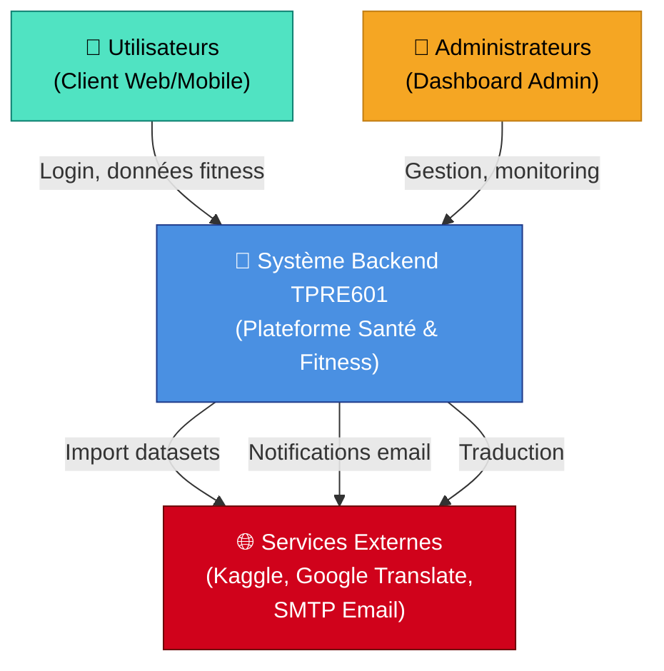
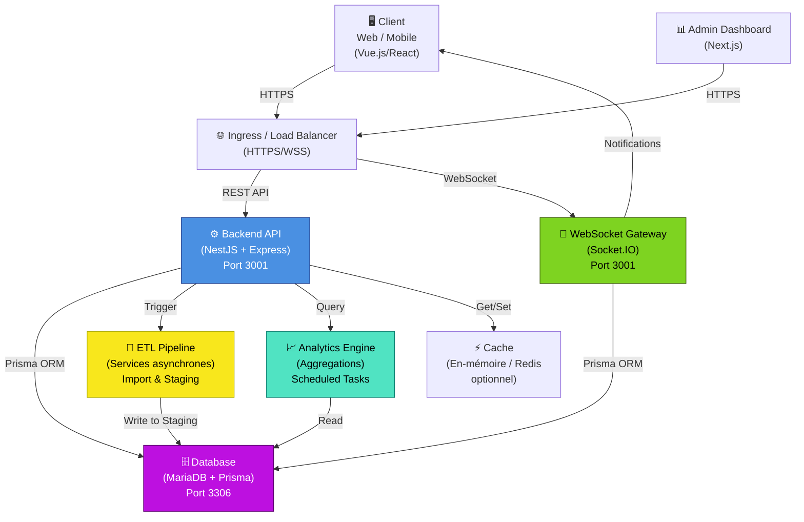
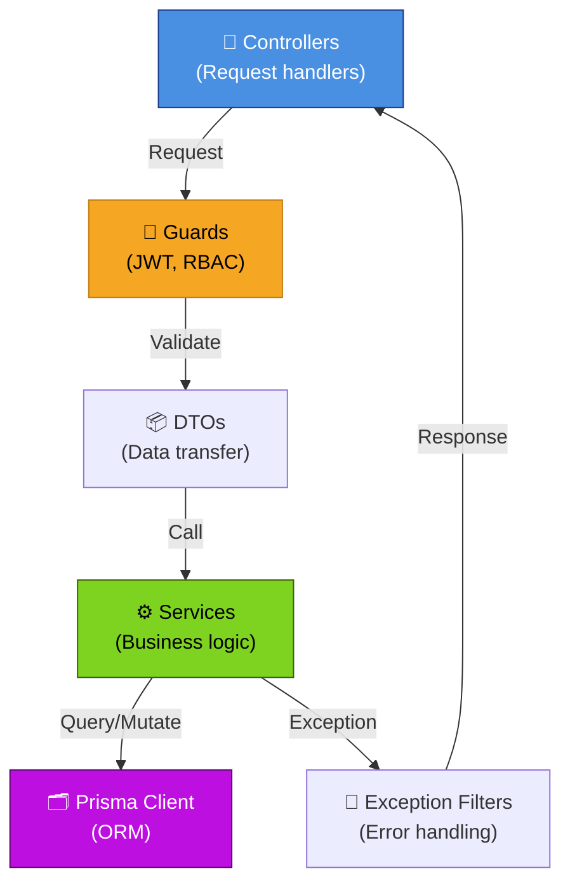
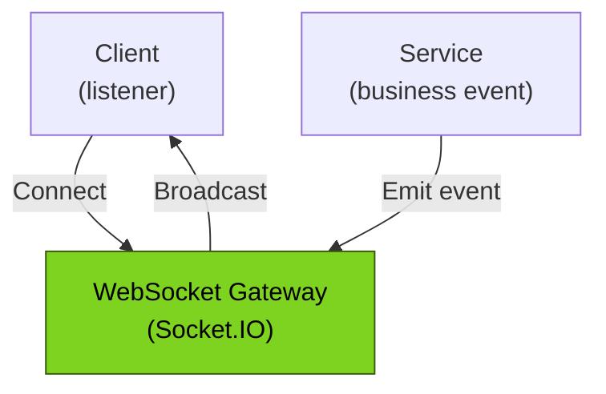
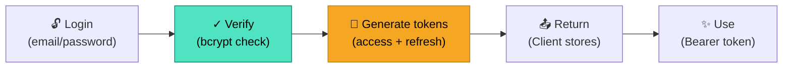

# Diagrammes C4 — Architecture Système

Les diagrammes C4 fournissent une vue hiérarchique de l'architecture système. Ils permettent de comprendre le contexte, les conteneurs, composants, et code à différents niveaux d'abstraction.

---

## 📊 Niveau 1 : Diagramme de Contexte

Vue système globale montrant les acteurs externes, les frontières du système, et les dépendances principales.



**Acteurs du système :**

- **Utilisateurs** : Accès via API REST et WebSocket pour données temps réel
- **Administrateurs** : Accès au dashboard admin pour gestion et monitoring
- **Services externes** : Kaggle (datasets), Google Translate, SMTP (emails)

---

## 🏗️ Niveau 2 : Diagramme de Conteneurs

Détail des conteneurs principaux, protocoles de communication, et technologies.



**Conteneurs :**

| Conteneur             | Port | Technologie         | Rôle                        |
| --------------------- | ---- | ------------------- | --------------------------- |
| **Backend API**       | 3001 | NestJS v11, Express | REST API, logique métier    |
| **WebSocket Gateway** | 3001 | Socket.IO           | Événements temps réel       |
| **Database**          | 3306 | MariaDB, Prisma ORM | Persistance données         |
| **ETL Pipeline**      | —    | Services async      | Import et nettoyage données |
| **Analytics**         | —    | Aggregations, cron  | Reporting et KPIs           |
| **Cache**             | —    | En-mémoire / Redis  | Optimisation performance    |

---

## 🧩 Niveau 3 : Composants Principaux (Backend)

Vue détaillée des modules NestJS et des couches.



**Couches :**

- **Controllers** : Points d'entrée HTTP/WebSocket
- **Guards** : Authentification (JWT) et autorisation (RBAC)
- **Services** : Logique métier, ETL, analytics
- **DTOs** : Validation et sérialisation des données
- **Prisma Client** : Abstraction ORM pour MariaDB

---

## 📡 Niveaux 4 : Patterns et Détails Technologiques

### Pattern ETL

```mermaid
graph LR
    Source["📥 Source Data<br/>(CSV, API externe)"]
    Extract["1️⃣ Extract<br/>(Parse CSV)"]
    Transform["2️⃣ Transform<br/>(Nettoyage, validation)"]
    Staging["3️⃣ Staging Table<br/>(cleaned_data JSON)"]
    Review["4️⃣ Human Review<br/>(PENDING → APPROVED)"]
    Load["5️⃣ Load<br/>(Insert to production)"]

    Source --> Extract
    Extract --> Transform
    Transform --> Staging
    Staging --> Review
    Review --> Load

    style Extract fill:#4A90E2,stroke:#1E3A8A,color:#fff
    style Transform fill:#7ED321,stroke:#3D5A0D,color:#000
    style Staging fill:#F5A623,stroke:#C17D12,color:#000
    style Review fill:#BD10E0,stroke:#5E0770,color:#fff
    style Load fill:#50E3C2,stroke:#0D7F70,color:#000
```



### Pattern WebSocket (Socket.IO)



### Pattern Authentification JWT



---

## 🔄 Flux de Communication

### REST API → Database

```
POST /nutrition → NutritionController
    → NutritionService.create()
    → PrismaService.nutrition.create()
    → MariaDB write
```

### WebSocket → Broadcast

```
SessionService.endSession()
    → this.eventGateway.broadcastSessionUpdate(sessionId)
    → Socket.IO emit to subscribed clients
```

### ETL Pipeline

```
ETLService.runImportPipeline()
    → Extract from CSV / external API
    → Transform + validate
    → Write to NutritionStaging table
    → Wait for manual approval (PENDING)
    → Load to Nutrition table (APPROVED)
```

---

## 📊 Voir aussi

- [Infrastructure Docker Compose](02-infrastructure-docker.md) — Configuration locale
- [Infrastructure Kubernetes](03-infrastructure-kubernetes.md) — Production
- [Flux de Données](05-flux-donnees.md) — Détail des interactions
- [ADRs](04-adr/) — Justifications des choix techniques
