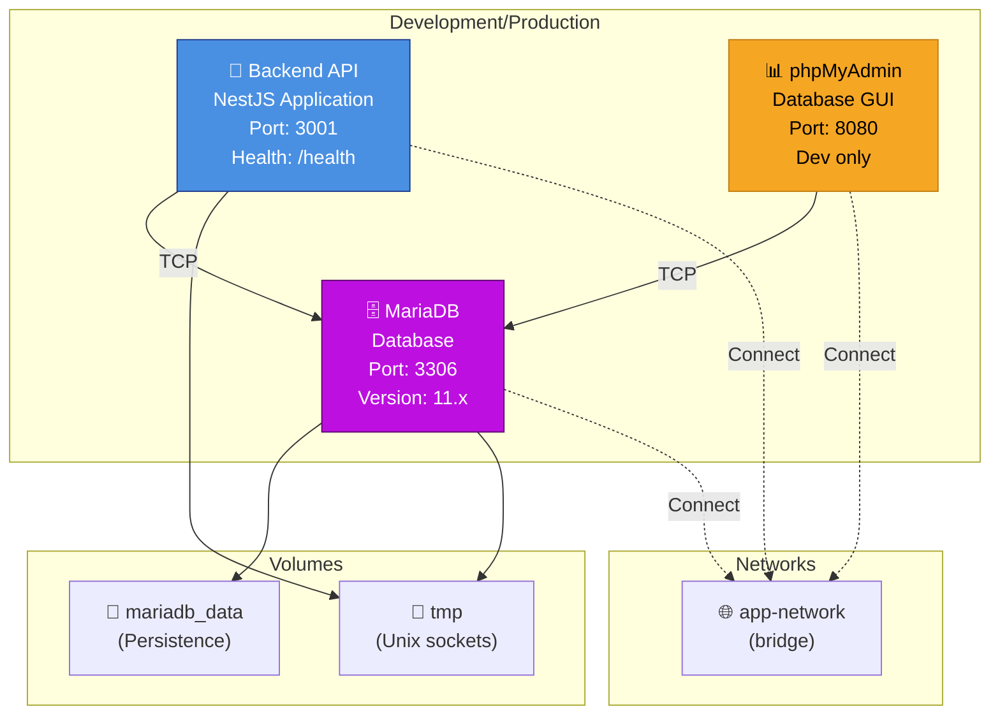

# Infrastructure Docker Compose

Documentation détaillée de l'orchestration Docker Compose pour développement et production.

---

## 📋 Aperçu des Services



---

## 🐳 Service : Backend API

### Image et Construction

```yaml
services:
  server:
    build:
      context: .
      dockerfile: Dockerfile
    restart: unless-stopped
```

**Dockerfile multi-stage :**

| Stage     | Rôle              | Détail                                              |
| --------- | ----------------- | --------------------------------------------------- |
| **base**  | Setup Node        | Alpine 22 LTS, corepack enable, workdir             |
| **build** | Compile & Install | pnpm install, prisma generate, npm run build        |
| **final** | Runtime           | Copie dist/ et node_modules (prod only), user: node |

### Variables d'Environnement (Production)

```yaml
environment:
  NODE_ENV: production
  PORT: 3001
  # Database
  DATABASE_URL: mysql://root:rootpassword@db:3306/backend?schema=public
  # JWT
  JWT_SECRET: ${JWT_SECRET}
  JWT_EXPIRES_IN: 900
  REFRESH_TOKEN_EXPIRES_IN: 604800
  # SMTP
  SMTP_HOST: ${SMTP_HOST}
  SMTP_PORT: ${SMTP_PORT}
  SMTP_USER: ${SMTP_USER}
  SMTP_PASS: ${SMTP_PASS}
  # Kaggle (ETL)
  KAGGLE_USER: ${KAGGLE_USER}
  KAGGLE_KEY: ${KAGGLE_KEY}
```

### Ports et Connectivité

| Port | Protocole | Publié        | Accès                  |
| ---- | --------- | ------------- | ---------------------- |
| 3001 | HTTP/WS   | OUI           | Clients, Load balancer |
| 3001 | HTTP      | NON (interne) | phpMyAdmin (dev)       |

### Healthcheck

```yaml
healthcheck:
  test: ['CMD', 'curl', '-f', 'http://localhost:3001/health']
  interval: 30s
  timeout: 10s
  retries: 3
  start_period: 40s
```

### Dépendances

```yaml
depends_on:
  db:
    condition: service_healthy
```

Le service attend que MariaDB soit prêt avant de démarrer.

---

## 🗄️ Service : MariaDB

### Configuration

```yaml
services:
  db:
    image: mariadb:11
    restart: unless-stopped
    environment:
      MYSQL_ROOT_PASSWORD: rootpassword
      MYSQL_DATABASE: backend
      MARIADB_AUTO_UPGRADE: 1
```

**Variables clés :**

- `MYSQL_ROOT_PASSWORD` : Mot de passe root (dev only, à changer en prod)
- `MYSQL_DATABASE` : Schéma créé au démarrage
- `MARIADB_AUTO_UPGRADE` : Upgraded schema automatically

### Ports

| Port | Publié | Accès                              |
| ---- | ------ | ---------------------------------- |
| 3306 | NON    | API uniquement (interne au réseau) |

**Connexion interne :** `mysql://root:rootpassword@db:3306/backend`

### Volumes

| Volume         | Chemin conteneur | Rôle                            |
| -------------- | ---------------- | ------------------------------- |
| `mariadb_data` | `/var/lib/mysql` | Persistance des données         |
| `tmp` (tmpfs)  | `/run/mysqld`    | Sockets et fichiers temporaires |

### Healthcheck

```yaml
healthcheck:
  test: ['CMD', 'healthcheck.sh', '--connect', '--innodb_initialized']
  interval: 10s
  timeout: 5s
  retries: 5
```

### Optimisations

```yaml
command:
  - --default-authentication-plugin=mysql_native_password
  - --max_connections=200
  - --innodb_buffer_pool_size=256M
```

---

## 📊 Service : phpMyAdmin (Développement)

Interface web pour gérer la base de données en développement.

```yaml
services:
  phpmyadmin:
    image: phpmyadmin:5.2
    restart: unless-stopped
    environment:
      PMA_HOST: db
      PMA_USER: root
      PMA_PASSWORD: rootpassword
    ports:
      - '8080:80'
    depends_on:
      - db
```

**Accès :** `http://localhost:8080`

- User: `root`
- Password: `rootpassword`

⚠️ **À DÉSACTIVER EN PRODUCTION**

---

## 🌐 Networks

### app-network (bridge)

Réseau isolé pour communication inter-services.

```yaml
networks:
  app-network:
    driver: bridge
    name: fitness-health-network
```

**Services connectés :**

- API (server)
- MariaDB (db)
- phpMyAdmin (phpmyadmin, dev only)

**Communication :**

- `api:3001` → `db:3306` (sans expose)
- `phpmyadmin:80` → `db:3306` (sans expose)

---

## 💾 Volumes

### mariadb_data

Persistance des données MariaDB entre redémarrages.

```yaml
volumes:
  mariadb_data:
    driver: local
    name: mariadb_data
```

**Chemin hôte (dev) :** `./mariadb_data/` (ou Docker volume)

### tmpfs (tmp)

Sockets MySQL temporaires (performance, non persisté).

```yaml
tmpfs:
  - /run/mysqld
```

---

## 🚀 Commandes Utiles

### Démarrer l'infrastructure

```bash
# Development avec rebuild
docker-compose up --build

# Production (image pré-compilée)
docker-compose -f compose.yaml up -d

# En arrière-plan
docker-compose up -d
```

### Arrêter les services

```bash
docker-compose down
```

### Voir les logs

```bash
# Tous les services
docker-compose logs -f

# Un service spécifique
docker-compose logs -f server
docker-compose logs -f db
```

### Exécuter une commande

```bash
# Entrer en shell dans le conteneur API
docker-compose exec server sh

# Exécuter une migration Prisma
docker-compose exec server npx prisma migrate deploy

# Exécuter une requête SQL
docker-compose exec db mysql -u root -prootpassword backend -e "SELECT * FROM User LIMIT 5;"
```

### Nettoyage

```bash
# Supprimer les conteneurs
docker-compose down

# Supprimer aussi les volumes (attention : perte de données)
docker-compose down -v

# Supprimer les images
docker-compose down --rmi all
```

---

## 🔒 Sécurité (Production)

⚠️ **Secrets à changer en production :**

```yaml
# ❌ NE PAS UTILISER EN PROD
MYSQL_ROOT_PASSWORD: rootpassword
```

**Solutions :**

1. **Variables d'environnement** (fichier `.env` chiffré)

   ```bash
   export MYSQL_ROOT_PASSWORD=$(openssl rand -base64 24)
   export JWT_SECRET=$(openssl rand -base64 32)
   ```

2. **Docker Secrets (Swarm)**

   ```yaml
   secrets:
     db_password:
       file: ./secrets/db_password.txt
   ```

3. **Secrets Kubernetes**
   ```bash
   kubectl create secret generic backend-secrets \
     --from-literal=DATABASE_PASSWORD=... \
     --from-literal=JWT_SECRET=...
   ```

---

## 📊 Voir aussi

- [Dockerfile](../../Dockerfile) — Build multi-stage
- [compose.yaml](../../compose.yaml) — Configuration complète
- [Infrastructure Kubernetes](03-infrastructure-kubernetes.md) — Production
- [Réseau et Sécurité](06-reseau-securite.md) — Détail sécurité
