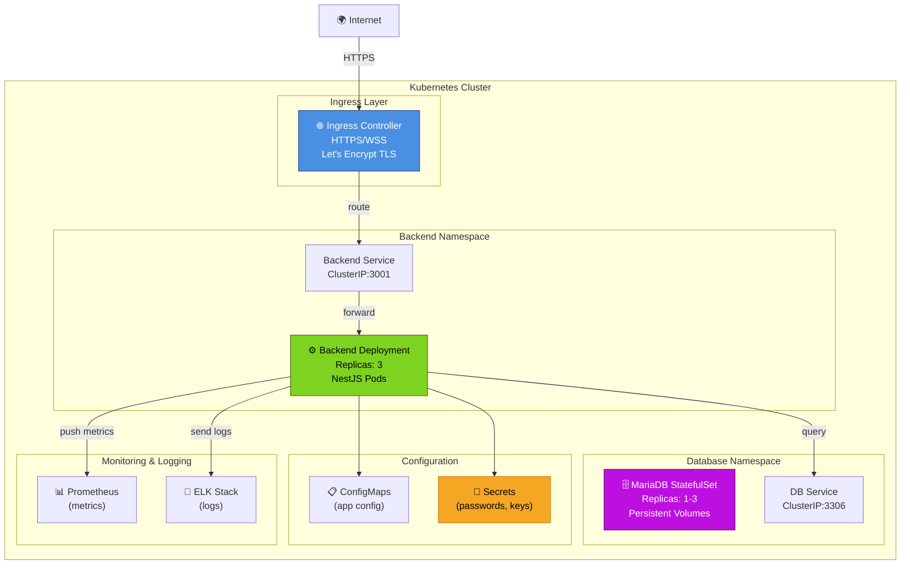

# Infrastructure Kubernetes

Configuration pour déploiement en production sur Kubernetes (K8s).

---

## 🏗️ Vue d'ensemble Architecture K8s



---

## 📦 Namespace Backend

### Deployment : Backend API

```yaml
apiVersion: apps/v1
kind: Deployment
metadata:
  name: backend
  namespace: fitness-app
spec:
  replicas: 3
  strategy:
    type: RollingUpdate
    rollingUpdate:
      maxSurge: 1
      maxUnavailable: 0
  selector:
    matchLabels:
      app: backend
  template:
    metadata:
      labels:
        app: backend
        version: v1
    spec:
      # Anti-affinity : pods sur différents nodes
      affinity:
        podAntiAffinity:
          preferredDuringSchedulingIgnoredDuringExecution:
            - weight: 100
              podAffinityTerm:
                labelSelector:
                  matchExpressions:
                    - key: app
                      operator: In
                      values:
                        - backend
                topologyKey: kubernetes.io/hostname

      containers:
        - name: backend
          image: myregistry.com/backend:latest
          imagePullPolicy: Always

          ports:
            - name: http
              containerPort: 3001
              protocol: TCP

          # Readiness probe
          readinessProbe:
            httpGet:
              path: /health
              port: 3001
            initialDelaySeconds: 20
            periodSeconds: 10
            timeoutSeconds: 5
            failureThreshold: 3

          # Liveness probe
          livenessProbe:
            httpGet:
              path: /health
              port: 3001
            initialDelaySeconds: 30
            periodSeconds: 30
            timeoutSeconds: 5
            failureThreshold: 3

          # Ressources
          resources:
            requests:
              memory: '256Mi'
              cpu: '250m'
            limits:
              memory: '512Mi'
              cpu: '500m'

          # Env from ConfigMap et Secrets
          envFrom:
            - configMapRef:
                name: backend-config
            - secretRef:
                name: backend-secrets

          # Logs
          volumeMounts:
            - name: logs
              mountPath: /var/log/app

      volumes:
        - name: logs
          emptyDir: {}
```

**Clés de configuration :**

| Clé              | Valeur  | Raison                     |
| ---------------- | ------- | -------------------------- |
| `replicas`       | 3       | Haute disponibilité        |
| `maxSurge`       | 1       | Pas trop de pods à la fois |
| `maxUnavailable` | 0       | Zero-downtime deployments  |
| `readinessProbe` | /health | Attendre avant routing     |
| `livenessProbe`  | /health | Restart si pas responsive  |
| `memory request` | 256Mi   | Allocation garantie        |
| `memory limit`   | 512Mi   | Cap pour éviter OOMKill    |

### Service : Backend

```yaml
apiVersion: v1
kind: Service
metadata:
  name: backend
  namespace: fitness-app
spec:
  type: ClusterIP
  selector:
    app: backend
  ports:
    - name: http
      port: 3001
      targetPort: 3001
      protocol: TCP
```

**Type ClusterIP :** Accès interne uniquement (via Ingress).

### HorizontalPodAutoscaler (HPA)

```yaml
apiVersion: autoscaling/v2
kind: HorizontalPodAutoscaler
metadata:
  name: backend-hpa
  namespace: fitness-app
spec:
  scaleTargetRef:
    apiVersion: apps/v1
    kind: Deployment
    name: backend
  minReplicas: 3
  maxReplicas: 10
  metrics:
    - type: Resource
      resource:
        name: cpu
        target:
          type: Utilization
          averageUtilization: 70
    - type: Resource
      resource:
        name: memory
        target:
          type: Utilization
          averageUtilization: 80
```

**Scaling :** Auto-scale de 3 à 10 pods si CPU > 70% ou memory > 80%.

---

## 🗄️ Namespace Database (MariaDB)

### StatefulSet : MariaDB

```yaml
apiVersion: apps/v1
kind: StatefulSet
metadata:
  name: mariadb
  namespace: fitness-app
spec:
  serviceName: mariadb
  replicas: 1 # Ou 3 pour replication avec Galera
  selector:
    matchLabels:
      app: mariadb
  template:
    metadata:
      labels:
        app: mariadb
    spec:
      containers:
        - name: mariadb
          image: mariadb:11

          env:
            - name: MYSQL_ROOT_PASSWORD
              valueFrom:
                secretKeyRef:
                  name: mariadb-secrets
                  key: root-password
            - name: MYSQL_DATABASE
              valueFrom:
                configMapKeyRef:
                  name: mariadb-config
                  key: database-name

          ports:
            - containerPort: 3306
              name: mysql

          volumeMounts:
            - name: data
              mountPath: /var/lib/mysql

  volumeClaimTemplates:
    - metadata:
        name: data
      spec:
        accessModes:
          - ReadWriteOnce
        storageClassName: fast-ssd
        resources:
          requests:
            storage: 50Gi
```

**Caractéristiques :**

- **StatefulSet** : Identité stable (mariadb-0, mariadb-1, …)
- **PersistentVolumeClaim** : Stockage persistant 50Gi
- **Secrets** : Password stocké sécurisé

### Service : MariaDB

```yaml
apiVersion: v1
kind: Service
metadata:
  name: mariadb
  namespace: fitness-app
spec:
  clusterIP: None # Headless service (StatefulSet)
  selector:
    app: mariadb
  ports:
    - port: 3306
      targetPort: 3306
```

---

## ⚙️ ConfigMaps et Secrets

### ConfigMap : Backend

```yaml
apiVersion: v1
kind: ConfigMap
metadata:
  name: backend-config
  namespace: fitness-app
data:
  NODE_ENV: 'production'
  PORT: '3001'
  LOG_LEVEL: 'info'
  DATABASE_HOST: 'mariadb'
  DATABASE_PORT: '3306'
  DATABASE_NAME: 'backend'
```

### Secret : Backend

```yaml
apiVersion: v1
kind: Secret
metadata:
  name: backend-secrets
  namespace: fitness-app
type: Opaque
stringData:
  JWT_SECRET: 'your-secret-key-here'
  DATABASE_USER: 'root'
  DATABASE_PASSWORD: 'secure-password'
  SMTP_PASSWORD: 'smtp-password'
  KAGGLE_KEY: 'kaggle-api-key'
```

⚠️ **À générer avec :**

```bash
kubectl create secret generic backend-secrets \
  --from-literal=JWT_SECRET=$(openssl rand -base64 32) \
  --from-literal=DATABASE_PASSWORD=$(openssl rand -base64 24) \
  --dry-run=client -o yaml | kubectl apply -f -
```

### ConfigMap : MariaDB

```yaml
apiVersion: v1
kind: ConfigMap
metadata:
  name: mariadb-config
  namespace: fitness-app
data:
  database-name: 'backend'
  max_connections: '200'
  innodb_buffer_pool_size: '256M'
```

---

## 🌐 Ingress

### Ingress : HTTPS avec Let's Encrypt

```yaml
apiVersion: networking.k8s.io/v1
kind: Ingress
metadata:
  name: backend-ingress
  namespace: fitness-app
  annotations:
    cert-manager.io/cluster-issuer: 'letsencrypt-prod'
    nginx.ingress.kubernetes.io/websocket-services: backend
    nginx.ingress.kubernetes.io/websocket-paths: /socket.io
    nginx.ingress.kubernetes.io/websocket-timeout: '3600'
spec:
  ingressClassName: nginx
  tls:
    - hosts:
        - api.fitness-app.com
      secretName: backend-tls-cert
  rules:
    - host: api.fitness-app.com
      http:
        paths:
          - path: /
            pathType: Prefix
            backend:
              service:
                name: backend
                port:
                  number: 3001
```

**Annotations :**

- `cert-manager.io/cluster-issuer` : Certificat Let's Encrypt auto-renouvelé
- `nginx.ingress.kubernetes.io/websocket-*` : Support WebSocket/Socket.IO

---

## 📊 Monitoring (Prometheus)

### ServiceMonitor : Scraping Prometheus

```yaml
apiVersion: monitoring.coreos.com/v1
kind: ServiceMonitor
metadata:
  name: backend-monitor
  namespace: fitness-app
spec:
  selector:
    matchLabels:
      app: backend
  endpoints:
    - port: http
      path: /metrics
      interval: 30s
```

**Endpoint** : `/metrics` (Prometheus format).

---

## 🚀 Commandes Déploiement

### Appliquer la configuration

```bash
# Créer le namespace
kubectl create namespace fitness-app

# Appliquer les manifests
kubectl apply -f k8s/

# Vérifier les pods
kubectl get pods -n fitness-app
kubectl logs -f deployment/backend -n fitness-app
```

### Mettre à jour l'image

```bash
# Rolling update
kubectl set image deployment/backend \
  backend=myregistry.com/backend:v1.2.0 \
  -n fitness-app

# Vérifier la progression
kubectl rollout status deployment/backend -n fitness-app
```

### Rollback

```bash
kubectl rollout undo deployment/backend -n fitness-app
```

### Scaler manuellement

```bash
kubectl scale deployment backend --replicas=5 -n fitness-app
```

---

## 📊 Voir aussi

- [Infrastructure Docker Compose](02-infrastructure-docker.md) — Développement local
- [Réseau et Sécurité](06-reseau-securite.md) — Détail sécurité K8s
- [Flux de Données](05-flux-donnees.md) — Architecture système
