# ADR-005 : Pattern ETL avec Tables Staging

**Status:** Accepted  
**Date:** 2026-05-29  
**Décideur:** Architecture Team

---

## Context

Importer et nettoyer des données externes (Kaggle datasets, uploads CSV) sans risquer la corruption de données métier. Besoins :

- Validation complète avant insertion
- Détection d'anomalies et nettoyage
- Approbation humaine avant insertion
- Audit trail (traçabilité)
- Rollback possible

### Alternatives évaluées

| Approche           | Avantages                    | Inconvénients                  |
| ------------------ | ---------------------------- | ------------------------------ |
| **Direct insert**  | Rapide, simple               | Risque corruption, pas d'audit |
| **ETL → Staging**  | Nettoyage, validation, audit | Complexe, overhead storage     |
| **Event-sourcing** | Traçabilité totale           | Overkill, complexe             |
| **Feature flags**  | Rollout graduel              | Pas de validation              |

---

## Decision

**Utiliser pattern ETL à 5 étapes avec tables Staging.**

### Architecture ETL

```mermaid
graph LR
    Source["📥 Source<br/>(Kaggle, CSV, API)"]
    Extract["1️⃣ Extract<br/>(Parse, décompresse)"]
    Transform["2️⃣ Transform<br/>(Nettoyage, validation)"]
    Staging["3️⃣ Staging<br/>(DB: NutritionStaging)"]
    Review["4️⃣ Review<br/>(Dashboard Admin)"]
    Approve["5️⃣ Approve<br/>(User clicks button)"]
    Load["6️⃣ Load<br/>(Insert to Nutrition)"]

    Source --> Extract
    Extract --> Transform
    Transform --> Staging
    Staging --> Review
    Review --> Approve
    Approve --> Load

    style Transform fill:#4A90E2,stroke:#1E3A8A,color:#fff
    style Staging fill:#F5A623,stroke:#C17D12,color:#000
    style Review fill:#BD10E0,stroke:#5E0770,color:#fff
```



---

## Tables Staging

### Schema Prisma

```prisma
model NutritionStaging {
  id            String   @id @default(uuid())
  cleaned_data  Json     // Données validées & nettoyées
  anomalies     Json     // Erreurs & warnings détectées
  status        String   @default("PENDING")
                         // PENDING | APPROVED | REJECTED
  created_by_id Int?     // User qui a lancé l'import
  created_at    DateTime @default(now())
  updated_at    DateTime @updatedAt

  createdBy     User?    @relation(fields: [created_by_id], references: [id])
}

model ExerciseStaging {
  id            String   @id @default(uuid())
  cleaned_data  Json
  anomalies     Json
  status        String   @default("PENDING")
  created_by_id Int?
  created_at    DateTime @default(now())
  updated_at    DateTime @updatedAt

  createdBy     User?    @relation(fields: [created_by_id], references: [id])
}

model HealthProfileStaging {
  id            String   @id @default(uuid())
  cleaned_data  Json
  anomalies     Json
  status        String   @default("PENDING")
  created_by_id Int?
  created_at    DateTime @default(now())
  updated_at    DateTime @updatedAt

  createdBy     User?    @relation(fields: [created_by_id], references: [id])
}
```

### Exemple Données Staging

```json
{
  "id": "uuid-123",
  "cleaned_data": {
    "meals": [
      {
        "name": "Breakfast",
        "calories": 450,
        "proteins_g": 25,
        "carbs_g": 45,
        "fats_g": 15,
        "date": "2026-05-29"
      }
    ]
  },
  "anomalies": [
    {
      "severity": "WARNING",
      "field": "meals[0].calories",
      "message": "Unusually high calorie count (450 kcal for breakfast)",
      "suggestion": "Verify with user"
    }
  ],
  "status": "PENDING",
  "created_at": "2026-05-29T14:00:00Z"
}
```

---

## Workflow Détaillé

### 1️⃣ Extract (Service ETL)

```typescript
// src/nutrition/etl/nutrition-etl.service.ts
async runImportPipeline(fileBuffer: Buffer) {
  // Parse CSV
  const rawData = Papa.parse(fileBuffer.toString());

  // Extract rows
  const extracted = rawData.data.map(row => ({
    name: row[0],
    calories: parseInt(row[1]),
    proteins_g: parseFloat(row[2]),
    // ...
  }));

  return extracted;
}
```

### 2️⃣ Transform (Nettoyage & Validation)

```typescript
async transformAndValidate(extracted: any[]) {
  const anomalies = [];
  const cleaned = extracted.map(meal => {
    // Validation
    if (meal.calories < 0) {
      anomalies.push({
        severity: 'ERROR',
        field: 'calories',
        message: 'Negative calories',
      });
      return null;
    }

    if (meal.calories > 5000) {
      anomalies.push({
        severity: 'WARNING',
        field: 'calories',
        message: 'Unusually high',
      });
    }

    // Nettoyage
    return {
      ...meal,
      name: meal.name.trim(),
      calories: Math.round(meal.calories),
    };
  });

  return { cleaned: cleaned.filter(Boolean), anomalies };
}
```

### 3️⃣ Staging (DB Write)

```typescript
async loadToStaging(userId: number, data: any) {
  const stagingRecord = await this.prisma.nutritionStaging.create({
    data: {
      cleaned_data: data.cleaned,
      anomalies: data.anomalies,
      status: 'PENDING',
      created_by_id: userId,
    },
  });

  return stagingRecord;
}
```

### 4️⃣ Review (Admin Dashboard)

Dashboard affiche :

- Liste des imports PENDING
- Données nettoyées (JSON viewer)
- Anomalies détectées
- Boutons : Approve / Reject / View Details

### 5️⃣ Approve (User Action)

```typescript
// src/nutrition/controllers/nutrition-staging.controller.ts
@Patch(':id/approve')
@UseGuards(JwtAuthGuard)
async approveStagingRecord(
  @Param('id') id: string,
  @GetUser() user: User,
) {
  if (!this.hasAdminPermission(user)) {
    throw new ForbiddenException();
  }

  const stagingRecord = await this.prisma.nutritionStaging.update({
    where: { id },
    data: { status: 'APPROVED' },
  });

  // Trigger Load
  this.nutritionService.loadFromStaging(stagingRecord);

  return stagingRecord;
}
```

### 6️⃣ Load (Final Insert)

```typescript
async loadFromStaging(stagingRecord: NutritionStaging) {
  const { cleaned_data } = stagingRecord;

  // Transaction pour atomicité
  await this.prisma.$transaction(async (tx) => {
    // Insert main table
    const meals = await tx.nutrition.createMany({
      data: cleaned_data.meals.map(meal => ({
        ...meal,
        created_at: new Date(),
      })),
    });

    // Mark staging as LOADED
    await tx.nutritionStaging.update({
      where: { id: stagingRecord.id },
      data: { status: 'LOADED' },
    });
  });

  return meals;
}
```

---

## API Endpoints

| Endpoint                         | Méthode | Description                    |
| -------------------------------- | ------- | ------------------------------ |
| `/nutrition/import`              | POST    | Upload CSV, lance ETL          |
| `/nutrition/staging`             | GET     | Liste imports (status=PENDING) |
| `/nutrition/staging/:id`         | GET     | Détail import + anomalies      |
| `/nutrition/staging/:id/approve` | PATCH   | Approuver → Load               |
| `/nutrition/staging/:id/reject`  | PATCH   | Rejeter (status=REJECTED)      |

---

## Consequences

### Positives

✅ **Data integrity** : Validation avant insertion  
✅ **Audit trail** : Traçabilité complète (who, when, what)  
✅ **Human-in-loop** : Approbation avant production  
✅ **Reversible** : Rejeter ou rollback possible  
✅ **Anomaly detection** : Alertes sur données suspectes  
✅ **Decoupled** : ETL asynchrone (pas de blocage API)

### Negatives

❌ **Latency** : Données pas immédiatement disponibles  
❌ **Storage** : Staging tables = duplication temporaire  
❌ **Manual step** : Approbation requise (bottleneck)  
❌ **Complexity** : Plus de code, plus de states

---

## Monitoring & Alerts

### Métriques

```typescript
// StagingMetrics
stagingRecords.total
stagingRecords.pending (age moyen)
stagingRecords.rejected
stagingRecords.loaded

anomalies.count
anomalies.by_severity (ERROR, WARNING)
```

### Alertes

```typescript
// Si PENDING > 1 jour → Alert
// Si ERROR anomalies > 50% → Alert
// Si Load échoue → Alert + Slack notification
```

---

## Batch Operations

### Traiter plusieurs imports

```typescript
@Post('/staging/approve-batch')
async approveBatch(@Body() body: { ids: string[] }) {
  return await this.prisma.$transaction(
    body.ids.map(id =>
      this.prisma.nutritionStaging.update({
        where: { id },
        data: { status: 'APPROVED' },
      })
    )
  );
}
```

---

## Voir aussi

- [ADR-002 : Prisma](ADR-002-mariadb-prisma.md)
- [ETL Documentation](../../documentation/etl.md)
- [Nutrition Domain](../../documentation/nutrition.md)
- [Flux de Données](../05-flux-donnees.md)
