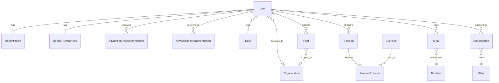

# Base de données

## Configuration

- **SGBD** : MariaDB (MySQL-compatible)
- **ORM** : Prisma v7
- **Schéma** : `prisma/schema.prisma`
- **Migrations** : `prisma/migrations/`
- **Seed** : `prisma/seed.ts`

## Commandes Prisma

```bash
npm run prisma:migrate    # Créer + appliquer une migration (dev)
npm run prisma:deploy     # Appliquer les migrations (prod)
npm run prisma:generate   # Régénérer le client après modif du schéma
npm run prisma:seed       # Peupler la base avec les données initiales
```

**Règle** : toute modification de `prisma/schema.prisma` doit être suivie de `npx prisma generate`.

---

## Modèles

### User

| Champ                         | Type      | Notes              |
| ----------------------------- | --------- | ------------------ |
| id                            | Int PK    | Auto-increment     |
| email                         | String    | Unique             |
| password_hash                 | String    | bcrypt (12 rounds) |
| refresh_token_hash            | String?   | Unique, SHA256     |
| email_verification_token_hash | String?   | Unique, SHA256     |
| reset_password_token_hash     | String?   | Unique, SHA256     |
| first_name                    | String    |                    |
| last_name                     | String    |                    |
| date_of_birth                 | DateTime? |                    |
| gender                        | String?   |                    |
| height                        | Float?    | En cm              |
| organization_id               | Int?      | FK → Organization  |
| role_id                       | Int?      | FK → Role          |
| is_active                     | Boolean   | default: true      |
| is_deleted                    | Boolean   | default: false     |
| created_at                    | DateTime  | default: now()     |
| updated_at                    | DateTime  | @updatedAt         |
| deleted_at                    | DateTime? | Soft delete        |

**Relations** : Organization, Role, HealthProfile (1-1), UserAiPreferences (1-1), Session[], Meal[], Subscription[], Post[], AiNutritionRecommendation[], AiWorkoutRecommendation[]

---

### Organization

| Champ                                | Type     | Notes                         |
| ------------------------------------ | -------- | ----------------------------- |
| id                                   | Int PK   |                               |
| name                                 | String   | Unique                        |
| type                                 | String   |                               |
| branding_config                      | Json     | `{ primaryColor?, logoUrl? }` |
| is_active                            | Boolean  | default: true                 |
| is_deleted                           | Boolean  | default: false                |
| created_at / updated_at / deleted_at | DateTime | Audit                         |

**Relations** : User[], Post[]

---

### Role

| Champ | Type   | Notes  |
| ----- | ------ | ------ |
| id    | Int PK |        |
| name  | String | Unique |

Rôles seedés automatiquement : `ADMIN`, `COACH`, `CLIENT`

**Relations** : User[]

---

### HealthProfile

| Champ                   | Type     | Notes                       |
| ----------------------- | -------- | --------------------------- |
| id                      | Int PK   |                             |
| user_id                 | Int      | Unique, FK → User (Cascade) |
| weight                  | Float    |                             |
| bmi                     | Float    |                             |
| physical_activity_level | String   |                             |
| daily_calories_target   | Int      |                             |
| updated_at              | DateTime | @updatedAt                  |

**Relations** : User (1-1)

---

### Session

| Champ          | Type     | Notes               |
| -------------- | -------- | ------------------- |
| id             | Int PK   |                     |
| user_id        | Int      | FK → User (Cascade) |
| duration_h     | Float    |                     |
| calories_total | Float    |                     |
| avg_bpm        | Float    |                     |
| max_bpm        | Float    |                     |
| resting_bpm    | Float?   |                     |
| created_at     | DateTime | default: now()      |

**Relations** : User, SessionExercise[]

---

### SessionExercise

Clé primaire composite : `(session_id, exercise_id)`

| Champ       | Type | Notes                   |
| ----------- | ---- | ----------------------- |
| session_id  | Int  | FK → Session (Cascade)  |
| exercise_id | Int  | FK → Exercise (Cascade) |

---

### Exercise

| Champ             | Type    | Notes  |
| ----------------- | ------- | ------ |
| id                | Int PK  |        |
| name              | String  | Unique |
| primary_muscles   | Json?   |        |
| secondary_muscles | Json?   |        |
| level             | String? |        |
| mechanic          | String? |        |
| equipment         | String? |        |
| category          | String? |        |
| exercise_type     | String? |        |
| instructions      | Json?   |        |
| image_urls        | Json?   |        |

**Relations** : SessionExercise[]

---

### Nutrition

| Champ           | Type    | Notes                              |
| --------------- | ------- | ---------------------------------- |
| id              | Int PK  |                                    |
| name            | String  | Unique composite (name + category) |
| category        | String  |                                    |
| calories_kcal   | Float   |                                    |
| protein_g       | Float   |                                    |
| carbohydrates_g | Float   |                                    |
| fat_g           | Float   |                                    |
| fiber_g         | Float   |                                    |
| sugar_g         | Float   |                                    |
| sodium_mg       | Float   |                                    |
| cholesterol_mg  | Float   |                                    |
| water_intake_ml | Float   |                                    |
| meal_type_name  | String? |                                    |
| picture_url     | String? |                                    |

**Relations** : Meal[]

---

### Meal

| Champ        | Type     | Notes                    |
| ------------ | -------- | ------------------------ |
| id           | Int PK   |                          |
| user_id      | Int      | FK → User (Cascade)      |
| nutrition_id | Int      | FK → Nutrition (Cascade) |
| created_at   | DateTime |                          |

**Relations** : User, Nutrition

---

### Plan

| Champ    | Type   | Notes                                        |
| -------- | ------ | -------------------------------------------- |
| id       | Int PK |                                              |
| name     | String | ex: "Freemium", "Premium", "Premium+", "B2B" |
| price    | Float  |                                              |
| features | Json   |                                              |

**Relations** : Subscription[]

---

### Subscription

| Champ      | Type     | Notes                          |
| ---------- | -------- | ------------------------------ |
| id         | Int PK   |                                |
| user_id    | Int      | FK → User (Cascade)            |
| plan_id    | Int      | FK → Plan (Cascade)            |
| start_date | DateTime |                                |
| end_date   | DateTime |                                |
| status     | String   | ex: "ACTIVE", "active", "true" |

**Relations** : User, Plan

Statuts actifs définis dans `src/utils/constants.ts` : `['ACTIVE', 'active', 'true']`

---

### Post

| Champ                   | Type     | Notes                                                                                        |
| ----------------------- | -------- | -------------------------------------------------------------------------------------------- |
| id                      | Int PK   |                                                                                              |
| author_id               | Int      | FK → User (Cascade)                                                                          |
| organization_id         | Int?     | FK → Organization (SetNull)                                                                  |
| title                   | String   |                                                                                              |
| content                 | LongText |                                                                                              |
| media_url               | Text?    | URL d'un média unique, ou tableau JSON d'URLs (plusieurs photos/vidéos) stockés sur S3/MinIO |
| is_published            | Boolean  | default: false                                                                               |
| created_at / updated_at | DateTime | Audit                                                                                        |

**Relations** : User (author), Organization

---

### UserAiPreferences

Préférences IA de l'utilisateur (allergies, régime, objectifs, matériel sportif).

| Champ                   | Type     | Notes                                                               |
| ----------------------- | -------- | ------------------------------------------------------------------- |
| id                      | Int PK   |                                                                     |
| user_id                 | Int      | Unique, FK → User (Cascade)                                         |
| allergies               | Json     | Liste de chaînes (ex. `["lactose"]`)                                |
| regime                  | String?  | ex. `vegetarien`, `vegan`                                           |
| budget                  | Float?   | Budget mensuel alimentation (€)                                     |
| objectif_ia             | String   | ex. `perte_de_poids`, `prise_de_masse`                              |
| contraintes_materielles | Json     | Équipement disponible                                               |
| limitations_physiques   | Json     | `@default("[]")` — ex. `["genou"]`, dédié au moteur sport           |
| preferences_sportives   | Json     | `@default("[]")` — ex. `["cardio", "matin"]`, dédié au moteur sport |
| allow_direct_messages   | Boolean  | `@default(true)`                                                    |
| language                | String   | `@default("fr")`                                                    |
| private_account         | Boolean  | `@default(false)`                                                   |
| units                   | String   | `@default("metric")`                                                |
| updated_at              | DateTime | @updatedAt                                                          |

**API** : `PUT /users/me/ai-preferences` (JWT requis)

**Relations** : User (1-1)

**Séparation sport / nutrition** : `limitations_physiques` et `preferences_sportives`
alimentent le profil envoyé au moteur de recommandation sportif
(`UserProfileForScoring` côté micro-service api-ia), distinctement de
`regime`/`allergies` qui restent propres au moteur nutrition — chaque champ
nourrit le moteur IA qui lui correspond, sans mélange entre les deux domaines
(`src/ai/services/ai-workout/ai-workout.service.ts`).

---

### AiNutritionRecommendation

Historique des analyses photo et plans de repas générés par l'IA nutrition.

| Champ             | Type     | Notes                                              |
| ----------------- | -------- | -------------------------------------------------- |
| id                | Int PK   |                                                    |
| user_id           | Int      | FK → User (Cascade)                                |
| type              | Enum     | `ANALYSIS` \| `MEAL_PLAN` (`AiRecommendationType`) |
| input_image_url   | String?  | URL de la photo analysée                           |
| aliments_detectes | Json?    | Résultat de détection                              |
| macros            | Json?    | Macros estimées                                    |
| suggestions       | Json?    | Conseils IA                                        |
| meal_plan         | Json?    | Plan de repas (si type `MEAL_PLAN`)                |
| created_at        | DateTime | default: now()                                     |

Index : `user_id`, `created_at`

**Relations** : User

---

### AiWorkoutRecommendation

Référence relationnelle vers un programme sportif stocké dans le micro-service MongoDB.

| Champ               | Type     | Notes                                                  |
| ------------------- | -------- | ------------------------------------------------------ |
| id                  | Int PK   |                                                        |
| user_id             | Int      | FK → User (Cascade)                                    |
| microservice_ref_id | String   | ID du document MongoDB (UUID)                          |
| statut              | Enum     | `ACTIVE` \| `ARCHIVED` (`WorkoutRecommendationStatus`) |
| feedback            | Json?    | Note / commentaire utilisateur                         |
| generated_at        | DateTime | default: now()                                         |
| updated_at          | DateTime | @updatedAt                                             |

Index : `user_id`, `microservice_ref_id`

**Relations** : User

---

## Tables Staging (ETL)

Trois tables de staging avec la même structure :

`NutritionStaging` · `ExerciseStaging` · `HealthProfileStaging`

| Champ                   | Type      | Notes                                 |
| ----------------------- | --------- | ------------------------------------- |
| id                      | String PK | UUID                                  |
| cleaned_data            | Json      | Données nettoyées par le pipeline     |
| anomalies               | Json      | Anomalies détectées (`[]` si aucune)  |
| status                  | Enum      | `PENDING` \| `APPROVED` \| `REJECTED` |
| created_at / updated_at | DateTime  | Audit                                 |

Index sur le champ `status`.

**Flux** : les pipelines ETL écrivent uniquement dans ces tables. La validation humaine via le back-office approuve ou rejette chaque ligne avant insertion dans les tables finales.

---

## Diagramme des relations (simplifié)



Vue texte (extrait IA + cœur métier) :

```
Organization ──< User >── Role
                  │
    ┌─────────────┼──────────────────────────────┐
    │             │                              │
HealthProfile  UserAiPreferences          Session / Meal
    │             │                              │
    │      AiNutritionRecommendation      SessionExercise ── Exercise
    │      AiWorkoutRecommendation ──► MongoDB (microservice_ref_id)
    │
User ──< Subscription >── Plan
User ──< Post
```

---

## Mapping relationnel ↔ NoSQL

| Donnée                                                   | Stockage                                            | Justification                                                                                                                                                                              |
| -------------------------------------------------------- | --------------------------------------------------- | ------------------------------------------------------------------------------------------------------------------------------------------------------------------------------------------ |
| Préférences IA stables (allergies, régime, objectif)     | MySQL / Prisma `UserAiPreferences`                  | Profil utilisateur structuré, requêtes SQL, jointure directe avec `User`                                                                                                                   |
| Historique nutrition (analyses, macros, plans)           | MySQL / Prisma `AiNutritionRecommendation`          | Traçabilité et filtrage par `user_id` / date ; payloads JSON flexibles pour les sorties IA                                                                                                 |
| Programme sportif complet (séances, exercices détaillés) | MongoDB (micro-service dédié)                       | Modèle documentaire adapté aux programmes variables ; pas de schéma rigide côté sport IA                                                                                                   |
| Lien backend ↔ MongoDB                                   | MySQL `AiWorkoutRecommendation.microservice_ref_id` | Clé étrangère logique (UUID string) : le backend relationnel ne duplique pas le document MongoDB, il enregistre la référence, le statut (`ACTIVE` / `ARCHIVED`) et le feedback utilisateur |
| Catalogue d'aliments pour la détection photo             | MongoDB `nutrition_foods` (micro-service `api-ia`)  | Alimenté en lecture depuis `GET /nutrition` (notre table `Nutrition`, via un compte de service) : normalisation noms/alias pour matcher les labels renvoyés par le modèle de vision        |

**Flux typique — recommandation sportive :**

1. Le micro-service IA génère un programme et le persiste dans MongoDB → obtient un `_id` / UUID.
2. Le backend crée une ligne `AiWorkoutRecommendation` avec `microservice_ref_id = <uuid>` et `statut = ACTIVE`.
3. Pour afficher le détail du programme, l'API agrège la ligne SQL et appelle le micro-service avec `microservice_ref_id`.
4. À l'archivage ou au feedback, seuls `statut` et `feedback` sont mis à jour côté relationnel ; le document MongoDB peut rester inchangé pour l'audit.

**Flux confirmé — analyse photo nutrition (`POST /ai/nutrition/analyze-photo`) :**

1. Le backend reçoit la photo (JWT requis), l'upload sur S3/MinIO via `StorageService`.
2. Il appelle le micro-service `api-ia` (`X-API-Key`) avec `{ imageUrl, userId }`.
3. `api-ia` détecte les aliments par vision, puis résout chaque label via son catalogue MongoDB `nutrition_foods` (lui-même synchronisé depuis notre table `Nutrition`).
4. Le backend persiste la réponse (`FoodAnalysisResult`) dans `AiNutritionRecommendation` avec `type = ANALYSIS` — aucune nouvelle colonne, le contrat correspond 1:1 aux champs JSON existants (`aliments_detectes`, `macros`, `suggestions`).

**Choix JSON dans Prisma :** les champs `allergies`, `aliments_detectes`, `macros`, `meal_plan`, `feedback` évoluent avec les modèles IA sans migration à chaque nouveau champ métier. Les entités relationnelles (clés, dates, statuts) restent typées et indexables en SQL.
