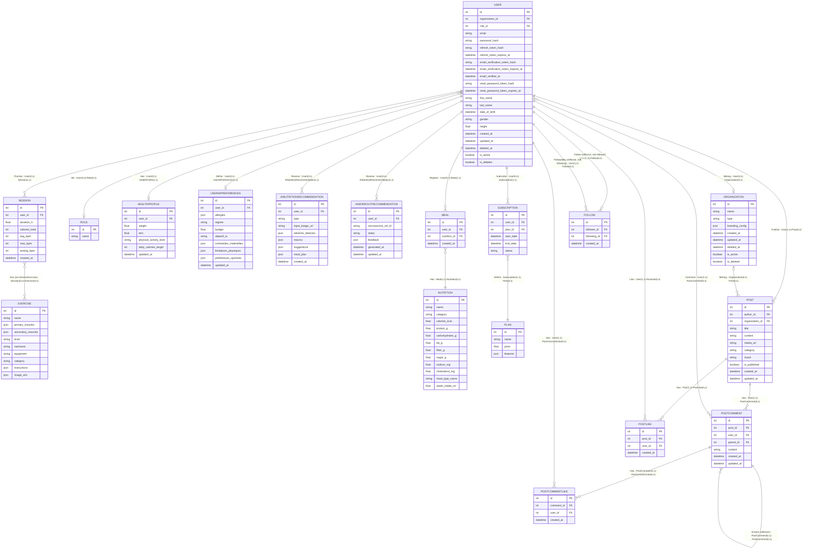

# Modèle de données — MLD / MCD / DD

Document complet du modèle de données relationnel, au format Merise : Modèle
Logique de Données (MLD), Modèle Conceptuel de Données (MCD), Dictionnaire de
Données (DD). Les noms reprennent ceux des modèles Prisma
(`prisma/schema.prisma`) pour une correspondance directe avec
l'implémentation — y compris les champs `limitations_physiques` /
`preferences_sportives` (migration `20260610000000_add_limitations_preferences_sportives`,
branche `feat/ai-photo-food-detection`).

Les entités/champs marqués **[NOUVEAU]** ont été ajoutés pour l'API IA (MSPR
TPRE502) ; le reste constitue le socle existant (MSPR TPRE501).

---

## 1. Modèle Logique de Données (MLD)

Notation : `Table(id, #cle_etrangere, champ1, champ2, ...)`.

```
Organization(id, name, type, branding_config, created_at, updated_at, deleted_at, is_active, is_deleted)

User(id, #organization_id, #role_id, email, password_hash, refresh_token_hash,
     refresh_token_expires_at, email_verification_token_hash,
     email_verification_token_expires_at, email_verified_at,
     reset_password_token_hash, reset_password_token_expires_at,
     first_name, last_name, date_of_birth, gender, height,
     created_at, updated_at, deleted_at, is_active, is_deleted)

Role(id, name)

Plan(id, name, price, features)

Subscription(id, #user_id, #plan_id, start_date, end_date, status)

HealthProfile(id, #user_id, weight, bmi, physical_activity_level, daily_calories_target, updated_at)

UserAiPreferences [NOUVEAU](id, #user_id, allergies, regime, budget, objectif_ia,
     contraintes_materielles, limitations_physiques, preferences_sportives,
     allow_direct_messages, language, private_account, units, updated_at)

AiNutritionRecommendation [NOUVEAU](id, #user_id, type, input_image_url,
     aliments_detectes, macros, suggestions, meal_plan, created_at)

AiWorkoutRecommendation [NOUVEAU](id, #user_id, microservice_ref_id, statut,
     feedback, generated_at, updated_at)

Nutrition(id, name, category, calories_kcal, protein_g, carbohydrates_g, fat_g,
     fiber_g, sugar_g, sodium_mg, cholesterol_mg, meal_type_name,
     water_intake_ml, picture_url)

Meal(id, #user_id, #nutrition_id, created_at)

Exercise(id, name, primary_muscles, secondary_muscles, level, mechanic,
     equipment, category, instructions, image_urls, exercise_type)

Session(id, #user_id, duration_h, calories_total, avg_bpm, max_bpm, resting_bpm, created_at)

SessionExercise(#session_id, #exercise_id)

NutritionStaging(id, cleaned_data, anomalies, status, created_at, updated_at)

ExerciseStaging(id, cleaned_data, anomalies, status, created_at, updated_at)

HealthProfileStaging(id, cleaned_data, anomalies, status, created_at, updated_at)

Post(id, #author_id, #organization_id, title, content, media_url, category,
     mood, is_published, created_at, updated_at)

PostComment(id, #post_id, #user_id, #parent_id, content, created_at, updated_at)

PostLike(id, #post_id, #user_id, created_at)

PostCommentLike(id, #comment_id, #user_id, created_at)

Follow(id, #follower_id, #following_id, created_at)
```

---

## 2. Modèle Conceptuel de Données (MCD)

Notation Merise : entités (PK en **gras souligné**, FK préfixées par `#`) reliées par des
associations nommées (verbes), chaque lien portant une cardinalité `(min,max)` avec
min/max ∈ `{0, 1, n}`.

### 2.1 Entités

#### Socle existant

| Entité                   | Attributs                                                                                                                                                     |
| ------------------------ | ------------------------------------------------------------------------------------------------------------------------------------------------------------- |
| **User**                 | <u>**id**</u>, `# organization_id`, `# role_id`, email, password_hash, first_name, last_name, date_of_birth, gender, height, is_active, is_deleted            |
| **Organization**         | <u>**id**</u>, name, type, branding_config, is_active, is_deleted                                                                                             |
| **Role**                 | <u>**id**</u>, name                                                                                                                                           |
| **HealthProfile**        | <u>**id**</u>, `# user_id`, weight, bmi, physical_activity_level, daily_calories_target                                                                       |
| **Session**              | <u>**id**</u>, `# user_id`, duration_h, calories_total, avg_bpm, max_bpm, resting_bpm, created_at                                                             |
| **SessionExercise**      | `# session_id`, `# exercise_id` _(clé composite)_                                                                                                             |
| **Exercise**             | <u>**id**</u>, name, primary_muscles, secondary_muscles, level, mechanic, equipment, category, instructions, image_urls                                       |
| **Nutrition**            | <u>**id**</u>, name, category, calories_kcal, protein_g, carbohydrates_g, fat_g, fiber_g, sugar_g, sodium_mg, cholesterol_mg, meal_type_name, water_intake_ml |
| **Meal**                 | <u>**id**</u>, `# user_id`, `# nutrition_id`, created_at                                                                                                      |
| **Plan**                 | <u>**id**</u>, name, price, features                                                                                                                          |
| **Subscription**         | <u>**id**</u>, `# user_id`, `# plan_id`, start_date, end_date, status                                                                                         |
| **Post**                 | <u>**id**</u>, `# author_id`, `# organization_id`, title, content, media_url, category, mood, is_published, created_at, updated_at                            |
| **PostComment**          | <u>**id**</u>, `# post_id`, `# user_id`, `# parent_id`, content, created_at, updated_at                                                                       |
| **PostLike**             | <u>**id**</u>, `# post_id`, `# user_id`, created_at                                                                                                           |
| **PostCommentLike**      | <u>**id**</u>, `# comment_id`, `# user_id`, created_at                                                                                                        |
| **Follow**               | <u>**id**</u>, `# follower_id`, `# following_id`, created_at                                                                                                  |
| **NutritionStaging**     | <u>**id**</u> (UUID), cleaned_data, anomalies, status, created_at, updated_at                                                                                 |
| **ExerciseStaging**      | <u>**id**</u> (UUID), cleaned_data, anomalies, status, created_at, updated_at                                                                                 |
| **HealthProfileStaging** | <u>**id**</u> (UUID), cleaned_data, anomalies, status, created_at, updated_at                                                                                 |

#### Entités ajoutées pour l'API IA **[NOUVEAU]**

| Entité                        | Attributs                                                                                                                                             | Pourquoi cette structure                                                                                                                                                                                                                                                                                                                                                                                                                                            |
| ----------------------------- | ----------------------------------------------------------------------------------------------------------------------------------------------------- | ------------------------------------------------------------------------------------------------------------------------------------------------------------------------------------------------------------------------------------------------------------------------------------------------------------------------------------------------------------------------------------------------------------------------------------------------------------------- |
| **UserAiPreferences**         | <u>**id**</u>, `# user_id`, allergies, regime, budget, objectif_ia, contraintes_materielles, limitations_physiques, preferences_sportives, updated_at | Profil IA stable, 1-1 avec User. Listes en JSON (allergies, contraintes_materielles) car leur contenu varie sans justifier une table de jointure dédiée. `limitations_physiques`/`preferences_sportives` séparent les contraintes sport des contraintes nutrition : chaque champ nourrit le moteur IA qui lui correspond (sport vs nutrition), sans mélange entre les deux domaines.                                                                                |
| **AiNutritionRecommendation** | <u>**id**</u>, `# user_id`, type, input_image_url, aliments_detectes, macros, suggestions, meal_plan, created_at                                      | Historique append-only : une ligne par appel IA vision/nutrition. Sorties IA en JSON pour absorber l'évolution des modèles sans migration de schéma. Alimentée par `POST /ai/nutrition/analyze-photo` (type=ANALYSIS, photo uploadée sur S3 puis envoyée au micro-service `api-ia`) et par le meal-plan (type=MEAL_PLAN) — aucun champ supplémentaire requis, le contrat `FoodAnalysisResult` retourné par le micro-service correspond 1:1 aux colonnes existantes. |
| **AiWorkoutRecommendation**   | <u>**id**</u>, `# user_id`, microservice_ref_id, statut, feedback, generated_at, updated_at                                                           | Le programme sportif complet est généré et stocké par le micro-service de recommandation (MongoDB, cf. besoin III.2). Le relationnel ne garde que la référence (`microservice_ref_id`), le statut et le feedback — pas de duplication du document.                                                                                                                                                                                                                  |

### 2.2 Associations

| Association                              | Entité A (cardinalité) | Entité B (cardinalité)                 |
| ---------------------------------------- | ---------------------- | -------------------------------------- |
| Has                                      | User (0,1)             | HealthProfile (1,1)                    |
| **Define [NOUVEAU]**                     | User (0,1)             | UserAiPreferences (1,1)                |
| **Receive [NOUVEAU]**                    | User (0,n)             | AiNutritionRecommendation (1,1)        |
| **Receive [NOUVEAU]**                    | User (0,n)             | AiWorkoutRecommendation (1,1)          |
| Belong                                   | User (0,n)             | Organization (0,1)                     |
| Be                                       | User (0,n)             | Role (0,1)                             |
| Practice                                 | User (0,n)             | Session (1,1)                          |
| Has                                      | Session (0,n)          | Exercise (0,n) _(via SessionExercise)_ |
| Register                                 | User (0,n)             | Meal (1,1)                             |
| Has                                      | Meal (1,1)             | Nutrition (0,n)                        |
| Subscribe                                | User (0,n)             | Subscription (1,1)                     |
| Define                                   | Subscription (1,1)     | Plan (0,n)                             |
| Publish                                  | User (1,1)             | Post (0,n)                             |
| Belong                                   | Organization (0,1)     | Post (0,n)                             |
| Has                                      | Post (1,1)             | PostComment (0,n)                      |
| Comment                                  | User (1,1)             | PostComment (0,n)                      |
| Answer _(réflexive)_                     | PostComment (0,1)      | PostComment (0,n)                      |
| Has                                      | Post (1,1)             | PostLike (0,n)                         |
| Like                                     | User (1,1)             | PostLike (0,n)                         |
| Has                                      | PostComment (1,1)      | PostCommentLike (0,n)                  |
| Like                                     | User (1,1)             | PostCommentLike (0,n)                  |
| Follow _(rôle follower, réflexive)_      | User (1,1)             | Follow (0,n)                           |
| FollowedBy _(rôle following, réflexive)_ | User (1,1)             | Follow (0,n)                           |

`AiWorkoutRecommendation.microservice_ref_id` référence un document MongoDB géré par le
micro-service de recommandation — lien logique, pas de FK SQL, donc pas d'association MCD.

Les tables `*Staging` ne portent aucune association : elles ne sont liées à aucune entité
métier avant validation humaine (`status = APPROVED`) et insertion dans la table finale
correspondante.

> **Note sur le diagramme visuel** : le rendu graphique habituel d'un MCD (boîtes
> reliées par des losanges d'association) est représenté ici en notation texte +
> diagramme Mermaid (§2.3) — fonctionnellement équivalent, et qui reste lisible/
> versionné dans le repo Git plutôt que dans un fichier image externe. Si un export
> image/PDF spécifique est requis pour la soutenance, le bloc Mermaid ci-dessous se
> rend tel quel sur GitHub ou via n'importe quel éditeur Markdown supportant Mermaid.

### 2.3 Diagramme (rendu visuel complet — attributs + cardinalités)

Chaque relation porte sa cardinalité Merise explicite `EntiteA(min,max) – EntiteB(min,max)`
en plus du symbole patte-de-corbeau Mermaid (qui encode la même information visuellement).



### 2.4 Synthèse des adaptations

| Type d'adaptation                 | Détail                                                                                                                                                                                                                                                                                                                                          |
| --------------------------------- | ----------------------------------------------------------------------------------------------------------------------------------------------------------------------------------------------------------------------------------------------------------------------------------------------------------------------------------------------- |
| Ajout d'entités                   | `UserAiPreferences`, `AiNutritionRecommendation`, `AiWorkoutRecommendation`                                                                                                                                                                                                                                                                     |
| Modification d'entités existantes | `UserAiPreferences` += `limitations_physiques` (Json, `@default("[]")`), `preferences_sportives` (Json, `@default("[]")`) — migration `20260610000000_add_limitations_preferences_sportives`. Sépare les contraintes/préférences sportives des contraintes nutrition (`regime`, `allergies`) : chaque champ nourrit le moteur IA correspondant. |
| Nouvelles associations            | `Define`, `Receive` (×2) — toutes vers `User`, aucune vers les autres entités historiques                                                                                                                                                                                                                                                       |
| Lien vers le NoSQL                | `AiWorkoutRecommendation.microservice_ref_id` → document MongoDB (micro-service de recommandation), couplage faible sans FK SQL                                                                                                                                                                                                                 |
| Champs JSON                       | Réservés aux sorties IA à structure variable (`aliments_detectes`, `macros`, `suggestions`, `meal_plan`, `feedback`) pour éviter une migration de schéma à chaque évolution de modèle                                                                                                                                                           |
| Flux confirmé (implémenté)        | `POST /ai/nutrition/analyze-photo` (JWT) : upload S3 → appel `api-ia` (`X-API-Key`) → `AiNutritionRecommendation.create({ type: 'ANALYSIS', ... })`. Aucun ajout de colonne nécessaire.                                                                                                                                                         |
| Flux confirmé (budget)            | `budget` (`UserAiPreferences`) → `AiNutritionService.generateMealPlanForUser` → `MealPlanRequest.budget` (api-ia) : mêmes noms de champs et mêmes types de bout en bout.                                                                                                                                                                        |

Côté micro-service `api-ia` (repo séparé), le catalogue d'aliments MongoDB (`nutrition_foods`) utilisé
pour la détection est lui-même alimenté à partir de notre table `Nutrition` (lecture paginée de
`GET /nutrition` via un compte de service). Ce flux relationnel → NoSQL est unidirectionnel et ne
modifie aucune entité de ce MCD ; voir [database.md](database.md) pour le détail.

---

## 3. Dictionnaire de Données (DD)

Définit précisément chaque champ du MLD : type, description, contraintes.

### 3.1 Organization

| Nom du champ    | Type      | Description                                | Contraintes                              |
| --------------- | --------- | ------------------------------------------ | ---------------------------------------- |
| id              | Int       | Identifiant unique                         | PK, Auto-increment                       |
| name            | String    | Nom de la structure                        | Unique, NOT NULL                         |
| type            | String    | Secteur d'activité                         | NOT NULL                                 |
| branding_config | Json      | Styles graphiques (couleurs, logos)        | NOT NULL (`{ primaryColor?, logoUrl? }`) |
| created_at      | Timestamp | Date et heure de création                  | DEFAULT now()                            |
| updated_at      | Timestamp | Date et heure de modification              | @updatedAt                               |
| deleted_at      | Timestamp | Date et heure de suppression (soft delete) | Nullable                                 |
| is_active       | Boolean   | Organisation active ou non                 | DEFAULT true                             |
| is_deleted      | Boolean   | Flag de suppression logique                | DEFAULT false                            |

### 3.2 User

| Nom du champ                        | Type      | Description                                | Contraintes        |
| ----------------------------------- | --------- | ------------------------------------------ | ------------------ |
| id                                  | Int       | Identifiant unique                         | PK, Auto-increment |
| organization_id                     | Int       | Organisation liée                          | FK, Nullable       |
| role_id                             | Int       | Rôle de l'utilisateur                      | FK, Nullable       |
| email                               | String    | Identifiant de connexion                   | Unique, NOT NULL   |
| password_hash                       | String    | Mot de passe haché (bcrypt 12 rounds)      | NOT NULL           |
| refresh_token_hash                  | String    | Hash SHA256 du refresh token courant       | Unique, Nullable   |
| refresh_token_expires_at            | Timestamp | Date d'expiration du refresh token         | Nullable           |
| email_verification_token_hash       | String    | Hash SHA256 du token de vérification email | Unique, Nullable   |
| email_verification_token_expires_at | Timestamp | Date d'expiration du token de vérification | Nullable           |
| email_verified_at                   | Timestamp | Date de vérification effective de l'email  | Nullable           |
| reset_password_token_hash           | String    | Hash SHA256 du token de reset mot de passe | Unique, Nullable   |
| reset_password_token_expires_at     | Timestamp | Date d'expiration du token de reset        | Nullable           |
| first_name                          | String    | Prénom                                     | NOT NULL           |
| last_name                           | String    | Nom de famille                             | NOT NULL           |
| date_of_birth                       | DateTime  | Date de naissance                          | Nullable           |
| gender                              | String    | Sexe déclaré                               | Nullable           |
| height                              | Float     | Taille en cm                               | Nullable           |
| created_at                          | Timestamp | Date et heure de l'inscription             | DEFAULT now()      |
| updated_at                          | Timestamp | Date et heure de mise à jour du profil     | @updatedAt         |
| deleted_at                          | Timestamp | Date et heure de suppression (soft delete) | Nullable           |
| is_active                           | Boolean   | État du compte                             | DEFAULT true       |
| is_deleted                          | Boolean   | Flag de suppression logique                | DEFAULT false      |

### 3.3 Role

| Nom du champ | Type   | Description                      | Contraintes        |
| ------------ | ------ | -------------------------------- | ------------------ |
| id           | Int    | Identifiant du rôle              | PK, Auto-increment |
| name         | String | Nom (`ADMIN`, `COACH`, `CLIENT`) | Unique, NOT NULL   |

### 3.4 Plan

| Nom du champ | Type   | Description                                    | Contraintes        |
| ------------ | ------ | ---------------------------------------------- | ------------------ |
| id           | Int    | Identifiant du plan                            | PK, Auto-increment |
| name         | String | Nom (`Freemium`, `Premium`, `Premium+`, `B2B`) | NOT NULL           |
| price        | Float  | Prix mensuel                                   | NOT NULL           |
| features     | Json   | Liste des fonctionnalités incluses             | NOT NULL           |

### 3.5 Subscription

| Nom du champ | Type     | Description                            | Contraintes        |
| ------------ | -------- | -------------------------------------- | ------------------ |
| id           | Int      | Identifiant de l'abonnement            | PK, Auto-increment |
| user_id      | Int      | Utilisateur abonné                     | FK, NOT NULL       |
| plan_id      | Int      | Plan choisi                            | FK, NOT NULL       |
| start_date   | DateTime | Date de début                          | DEFAULT now()      |
| end_date     | DateTime | Date de fin prévue                     | NOT NULL           |
| status       | String   | État (`ACTIVE`, `active`, `true`, ...) | NOT NULL           |

### 3.6 HealthProfile

| Nom du champ            | Type      | Description                              | Contraintes        |
| ----------------------- | --------- | ---------------------------------------- | ------------------ |
| id                      | Int       | Identifiant du profil santé              | PK, Auto-increment |
| user_id                 | Int       | Utilisateur concerné                     | FK, Unique         |
| weight                  | Float     | Poids actuel (kg)                        | Nullable           |
| bmi                     | Float     | Indice de Masse Corporelle               | Nullable           |
| physical_activity_level | String    | Niveau d'activité (sédentaire, actif...) | Nullable           |
| daily_calories_target   | Int       | Objectif calorique journalier            | Nullable           |
| updated_at              | Timestamp | Date et heure de mise à jour             | @updatedAt         |

### 3.7 UserAiPreferences **[NOUVEAU]**

| Nom du champ            | Type      | Description                                                               | Contraintes        |
| ----------------------- | --------- | ------------------------------------------------------------------------- | ------------------ |
| id                      | Int       | Identifiant du profil IA                                                  | PK, Auto-increment |
| user_id                 | Int       | Utilisateur concerné                                                      | FK, Unique         |
| allergies               | Json      | Liste d'allergies (ex. `["lactose"]`)                                     | NOT NULL           |
| regime                  | String    | Régime alimentaire (ex. `vegetarien`, `vegan`)                            | Nullable           |
| budget                  | Float     | Budget mensuel alimentation (€)                                           | Nullable           |
| objectif_ia             | String    | Objectif (`perte_de_poids`, `prise_de_masse`, ...)                        | NOT NULL           |
| contraintes_materielles | Json      | Équipement sportif disponible                                             | NOT NULL           |
| limitations_physiques   | Json      | Limitations physiques (ex. `["genou"]`) — dédié au moteur sport           | DEFAULT `[]`       |
| preferences_sportives   | Json      | Préférences sportives (ex. `["cardio", "matin"]`) — dédié au moteur sport | DEFAULT `[]`       |
| allow_direct_messages   | Boolean   | Autorise les messages privés                                              | DEFAULT true       |
| language                | String    | Langue préférée de l'utilisateur                                          | DEFAULT `fr`       |
| private_account         | Boolean   | Compte privé ou public                                                    | DEFAULT false      |
| units                   | String    | Système d'unités (`metric`/`imperial`)                                    | DEFAULT `metric`   |
| updated_at              | Timestamp | Date et heure de mise à jour                                              | @updatedAt         |

### 3.8 AiNutritionRecommendation **[NOUVEAU]**

| Nom du champ      | Type      | Description                                       | Contraintes           |
| ----------------- | --------- | ------------------------------------------------- | --------------------- |
| id                | Int       | Identifiant de la recommandation                  | PK, Auto-increment    |
| user_id           | Int       | Utilisateur concerné                              | FK, NOT NULL          |
| type              | Enum      | `ANALYSIS` (photo) ou `MEAL_PLAN` (plan de repas) | NOT NULL              |
| input_image_url   | String    | URL de la photo analysée                          | Nullable              |
| aliments_detectes | Json      | Résultat de détection vision IA                   | Nullable              |
| macros            | Json      | Macros estimées                                   | Nullable              |
| suggestions       | Json      | Conseils IA générés                               | Nullable              |
| meal_plan         | Json      | Plan de repas généré (si type `MEAL_PLAN`)        | Nullable              |
| created_at        | Timestamp | Date et heure de génération                       | DEFAULT now(), Indexé |

### 3.9 AiWorkoutRecommendation **[NOUVEAU]**

| Nom du champ        | Type      | Description                                                | Contraintes          |
| ------------------- | --------- | ---------------------------------------------------------- | -------------------- |
| id                  | Int       | Identifiant de la recommandation                           | PK, Auto-increment   |
| user_id             | Int       | Utilisateur concerné                                       | FK, NOT NULL, Indexé |
| microservice_ref_id | String    | Référence du programme dans MongoDB (micro-service api-ia) | NOT NULL, Indexé     |
| statut              | Enum      | `ACTIVE` ou `ARCHIVED`                                     | DEFAULT `ACTIVE`     |
| feedback            | Json      | Note / commentaire utilisateur sur le programme            | Nullable             |
| generated_at        | Timestamp | Date et heure de génération du programme                   | DEFAULT now()        |
| updated_at          | Timestamp | Date et heure de mise à jour (statut/feedback)             | @updatedAt           |

### 3.10 Nutrition

| Nom du champ    | Type   | Description                              | Contraintes                      |
| --------------- | ------ | ---------------------------------------- | -------------------------------- |
| id              | Int    | Identifiant de l'aliment                 | PK, Auto-increment               |
| name            | String | Nom de l'aliment                         | Unique composite avec `category` |
| category        | String | Catégorie (ex. `Légume`, `Fruits`)       | NOT NULL                         |
| calories_kcal   | Float  | Calories pour 100g                       | NOT NULL                         |
| protein_g       | Float  | Protéines pour 100g                      | NOT NULL                         |
| carbohydrates_g | Float  | Glucides pour 100g                       | NOT NULL                         |
| fat_g           | Float  | Lipides pour 100g                        | NOT NULL                         |
| fiber_g         | Float  | Fibres pour 100g                         | NOT NULL                         |
| sugar_g         | Float  | Sucres pour 100g                         | NOT NULL                         |
| sodium_mg       | Float  | Sodium pour 100g                         | NOT NULL                         |
| cholesterol_mg  | Float  | Cholestérol pour 100g                    | NOT NULL                         |
| meal_type_name  | String | Créneau de repas recommandé (label réel) | NOT NULL                         |
| water_intake_ml | Float  | Apport en eau                            | NOT NULL                         |
| picture_url     | String | URL de l'image de l'aliment              | Nullable                         |

### 3.11 Meal

| Nom du champ | Type      | Description                      | Contraintes        |
| ------------ | --------- | -------------------------------- | ------------------ |
| id           | Int       | Identifiant de l'entrée          | PK, Auto-increment |
| user_id      | Int       | Utilisateur ayant mangé          | FK, NOT NULL       |
| nutrition_id | Int       | Aliment consommé                 | FK, NOT NULL       |
| created_at   | Timestamp | Date et heure de la consommation | DEFAULT now()      |

### 3.12 Exercise

| Nom du champ      | Type   | Description                                    | Contraintes        |
| ----------------- | ------ | ---------------------------------------------- | ------------------ |
| id                | Int    | Identifiant de l'exercice                      | PK, Auto-increment |
| name              | String | Nom de l'exercice                              | Unique, NOT NULL   |
| primary_muscles   | Json   | Muscle(s) principalement sollicité(s)          | Nullable           |
| secondary_muscles | Json   | Muscles secondaires sollicités                 | Nullable           |
| level             | String | Niveau (débutant, intermédiaire, avancé)       | Nullable           |
| mechanic          | String | Type de mouvement (isolation, polyarticulaire) | Nullable           |
| equipment         | String | Matériel nécessaire                            | Nullable           |
| category          | String | Catégorie (force, étirement...)                | Nullable           |
| instructions      | Json   | Étapes de réalisation de l'exercice            | Nullable           |
| image_urls        | Json   | URLs des images illustratives                  | Nullable           |
| exercise_type     | String | Type (tirage, poussée...)                      | Nullable           |

### 3.13 Session

| Nom du champ   | Type      | Description                     | Contraintes        |
| -------------- | --------- | ------------------------------- | ------------------ |
| id             | Int       | Identifiant de la séance        | PK, Auto-increment |
| user_id        | Int       | Utilisateur ayant pratiqué      | FK, NOT NULL       |
| duration_h     | Float     | Durée en heures                 | NOT NULL           |
| calories_total | Int       | Estimation des calories brûlées | NOT NULL           |
| avg_bpm        | Int       | Rythme cardiaque moyen          | NOT NULL           |
| max_bpm        | Int       | Pulsations maximales atteintes  | NOT NULL           |
| resting_bpm    | Int       | Rythme cardiaque au repos       | Nullable           |
| created_at     | Timestamp | Date et heure de la séance      | DEFAULT now()      |

### 3.14 SessionExercise

| Nom du champ | Type | Description               | Contraintes        |
| ------------ | ---- | ------------------------- | ------------------ |
| session_id   | Int  | Identifiant de la séance  | PK (composite), FK |
| exercise_id  | Int  | Identifiant de l'exercice | PK (composite), FK |

### 3.15 NutritionStaging / ExerciseStaging / HealthProfileStaging

Structure identique pour les trois tables de staging ETL :

| Nom du champ | Type     | Description                                                | Contraintes               |
| ------------ | -------- | ---------------------------------------------------------- | ------------------------- |
| id           | String   | Identifiant du staging (UUID)                              | PK                        |
| cleaned_data | Json     | Données nettoyées par le pipeline                          | NOT NULL                  |
| anomalies    | Json     | Anomalies détectées (ex. calories > 9999 kcal, bmi > 9999) | NOT NULL (`[]` si aucune) |
| status       | Enum     | `PENDING`, `APPROVED`, `REJECTED`                          | DEFAULT `PENDING`, Indexé |
| created_at   | DateTime | Date et heure de création                                  | DEFAULT now()             |
| updated_at   | DateTime | Date et heure de modification                              | @updatedAt                |

### 3.16 Post

| Nom du champ    | Type     | Description                                            | Contraintes        |
| --------------- | -------- | ------------------------------------------------------ | ------------------ |
| id              | Int      | Identifiant unique de la publication                   | PK, Auto-increment |
| author_id       | Int      | Auteur du post                                         | FK, NOT NULL       |
| organization_id | Int      | Organisation liée (si applicable)                      | FK, Nullable       |
| title           | String   | Titre de la publication                                | NOT NULL           |
| content         | LongText | Corps du message                                       | NOT NULL           |
| media_url       | Text     | URL média (unique ou tableau JSON de plusieurs médias) | Nullable           |
| category        | String   | Catégorie du post                                      | Nullable           |
| mood            | String   | Humeur associée au post                                | Nullable           |
| is_published    | Boolean  | État de visibilité de la publication                   | DEFAULT false      |
| created_at      | DateTime | Date et heure de création                              | DEFAULT now()      |
| updated_at      | DateTime | Date et heure de modification                          | @updatedAt         |

### 3.17 PostComment

| Nom du champ | Type     | Description                               | Contraintes          |
| ------------ | -------- | ----------------------------------------- | -------------------- |
| id           | Int      | Identifiant unique du commentaire         | PK, Auto-increment   |
| post_id      | Int      | Post commenté                             | FK, NOT NULL, Indexé |
| user_id      | Int      | Auteur du commentaire                     | FK, NOT NULL         |
| parent_id    | Int      | Commentaire parent (pour les réponses)    | FK, Nullable, Indexé |
| content      | VarChar  | Contenu textuel du commentaire (max 4000) | NOT NULL             |
| created_at   | DateTime | Date et heure de création                 | DEFAULT now()        |
| updated_at   | DateTime | Date et heure de modification             | @updatedAt           |

### 3.18 PostLike

| Nom du champ | Type     | Description                  | Contraintes                                 |
| ------------ | -------- | ---------------------------- | ------------------------------------------- |
| id           | Int      | Identifiant unique du like   | PK, Auto-increment                          |
| post_id      | Int      | Post liké                    | FK, NOT NULL, Indexé                        |
| user_id      | Int      | Utilisateur ayant liké       | FK, NOT NULL                                |
| created_at   | DateTime | Date et heure de la réaction | DEFAULT now(), Unique (`post_id`+`user_id`) |

### 3.19 PostCommentLike

| Nom du champ | Type     | Description                  | Contraintes                                    |
| ------------ | -------- | ---------------------------- | ---------------------------------------------- |
| id           | Int      | Identifiant unique du like   | PK, Auto-increment                             |
| comment_id   | Int      | Commentaire liké             | FK, NOT NULL, Indexé                           |
| user_id      | Int      | Utilisateur ayant liké       | FK, NOT NULL                                   |
| created_at   | DateTime | Date et heure de la réaction | DEFAULT now(), Unique (`comment_id`+`user_id`) |

### 3.20 Follow

| Nom du champ | Type     | Description                       | Contraintes                                          |
| ------------ | -------- | --------------------------------- | ---------------------------------------------------- |
| id           | Int      | Identifiant unique de la relation | PK, Auto-increment                                   |
| follower_id  | Int      | Utilisateur qui suit              | FK, NOT NULL                                         |
| following_id | Int      | Utilisateur suivi                 | FK, NOT NULL, Indexé                                 |
| created_at   | DateTime | Date et heure du suivi            | DEFAULT now(), Unique (`follower_id`+`following_id`) |

---

Détail des types Prisma, contraintes physiques complètes et migrations :
[database.md](database.md).
