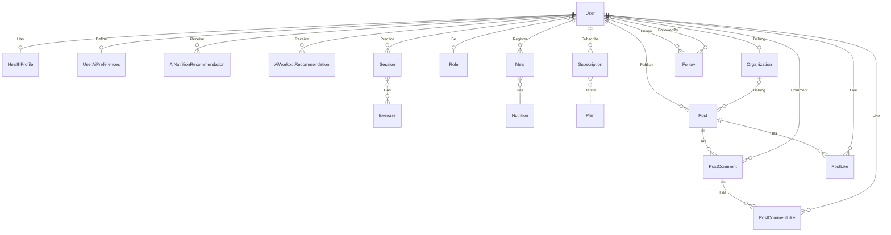

# Modèle Conceptuel de Données (MCD)

Notation Merise : entités (PK en **gras souligné**, FK préfixées par `#`) reliées par des
associations nommées (verbes), chaque lien portant une cardinalité `(min,max)` avec
min/max ∈ `{0, 1, n}`. Les noms reprennent ceux des modèles Prisma (`prisma/schema.prisma`)
pour une correspondance directe avec l'implémentation.

Les entités/associations marquées **[NOUVEAU]** ont été ajoutées pour l'API IA (MSPR
TPRE502) ; le reste constitue le socle existant (MSPR TPRE501), non modifié.

---

## 1. Entités

### Socle existant

| Entité                   | Attributs                                                                                                                                                     |
| ------------------------ | ------------------------------------------------------------------------------------------------------------------------------------------------------------- |
| **User**                 | <u>**id**</u>, `# organization_id`, `# role_id`, email, password_hash, first_name, last_name, date_of_birth, gender, height, is_active, is_deleted            |
| **Organization**         | <u>**id**</u>, name, type, branding_config, is_active, is_deleted                                                                                             |
| **Role**                 | <u>**id**</u>, name                                                                                                                                           |
| **HealthProfile**        | <u>**id**</u>, `# user_id`, weight, bmi, physical_activity_level, daily_calories_target                                                                       |
| **Session**              | <u>**id**</u>, `# user_id`, duration_h, calories_total, avg_bpm, max_bpm, resting_bpm, created_at                                                             |
| **SessionExercise**      | `# session_id`, `# exercise_id` _(clé composite)_                                                                                                             |
| **Exercise**             | <u>**id**</u>, name, primary_muscles, secondary_muscles, level, mechanic, equipment, category, instructions, image_urls                                       |
| **Nutrition**            | <u>**id**</u>, name, category, calories_kcal, protein_g, carbohydrates_g, fat_g, fiber_g, sugar_g, sodium_mg, cholesterol_mg, meal_type_name, water_intake_ml |
| **Meal**                 | <u>**id**</u>, `# user_id`, `# nutrition_id`, created_at                                                                                                      |
| **Plan**                 | <u>**id**</u>, name, price, features                                                                                                                          |
| **Subscription**         | <u>**id**</u>, `# user_id`, `# plan_id`, start_date, end_date, status                                                                                         |
| **Post**                 | <u>**id**</u>, `# author_id`, `# organization_id`, title, content, media_url, category, mood, is_published, created_at, updated_at                            |
| **PostComment**          | <u>**id**</u>, `# post_id`, `# user_id`, `# parent_id`, content, created_at, updated_at                                                                       |
| **PostLike**             | <u>**id**</u>, `# post_id`, `# user_id`, created_at                                                                                                           |
| **PostCommentLike**      | <u>**id**</u>, `# comment_id`, `# user_id`, created_at                                                                                                        |
| **Follow**               | <u>**id**</u>, `# follower_id`, `# following_id`, created_at                                                                                                  |
| **NutritionStaging**     | <u>**id**</u> (UUID), cleaned_data, anomalies, status, created_at, updated_at                                                                                 |
| **ExerciseStaging**      | <u>**id**</u> (UUID), cleaned_data, anomalies, status, created_at, updated_at                                                                                 |
| **HealthProfileStaging** | <u>**id**</u> (UUID), cleaned_data, anomalies, status, created_at, updated_at                                                                                 |

### Entités ajoutées pour l'API IA **[NOUVEAU]**

| Entité                        | Attributs                                                                                                        | Pourquoi cette structure                                                                                                                                                                                                                           |
| ----------------------------- | ---------------------------------------------------------------------------------------------------------------- | -------------------------------------------------------------------------------------------------------------------------------------------------------------------------------------------------------------------------------------------------- |
| **UserAiPreferences**         | <u>**id**</u>, `# user_id`, allergies, regime, budget, objectif_ia, contraintes_materielles, updated_at          | Profil IA stable, 1-1 avec User. Listes en JSON (allergies, contraintes_materielles) car leur contenu varie sans justifier une table de jointure dédiée.                                                                                           |
| **AiNutritionRecommendation** | <u>**id**</u>, `# user_id`, type, input_image_url, aliments_detectes, macros, suggestions, meal_plan, created_at | Historique append-only : une ligne par appel IA vision/nutrition. Sorties IA en JSON pour absorber l'évolution des modèles sans migration de schéma.                                                                                               |
| **AiWorkoutRecommendation**   | <u>**id**</u>, `# user_id`, microservice_ref_id, statut, feedback, generated_at, updated_at                      | Le programme sportif complet est généré et stocké par le micro-service de recommandation (MongoDB, cf. besoin III.2). Le relationnel ne garde que la référence (`microservice_ref_id`), le statut et le feedback — pas de duplication du document. |

---

## 2. Associations

| Association                              | Entité A (cardinalité) | Entité B (cardinalité)                 |
| ---------------------------------------- | ---------------------- | -------------------------------------- |
| Has                                      | User (0,1)             | HealthProfile (1,1)                    |
| **Define [NOUVEAU]**                     | User (0,1)             | UserAiPreferences (1,1)                |
| **Receive [NOUVEAU]**                    | User (0,n)             | AiNutritionRecommendation (1,1)        |
| **Receive [NOUVEAU]**                    | User (0,n)             | AiWorkoutRecommendation (1,1)          |
| Belong                                   | User (0,n)             | Organization (0,1)                     |
| Be                                       | User (0,n)             | Role (0,1)                             |
| Practice                                 | User (0,n)             | Session (1,1)                          |
| Has                                      | Session (0,n)          | Exercise (0,n) _(via SessionExercise)_ |
| Register                                 | User (0,n)             | Meal (1,1)                             |
| Has                                      | Meal (1,1)             | Nutrition (0,n)                        |
| Subscribe                                | User (0,n)             | Subscription (1,1)                     |
| Define                                   | Subscription (1,1)     | Plan (0,n)                             |
| Publish                                  | User (1,1)             | Post (0,n)                             |
| Belong                                   | Organization (0,1)     | Post (0,n)                             |
| Has                                      | Post (1,1)             | PostComment (0,n)                      |
| Comment                                  | User (1,1)             | PostComment (0,n)                      |
| Answer _(réflexive)_                     | PostComment (0,1)      | PostComment (0,n)                      |
| Has                                      | Post (1,1)             | PostLike (0,n)                         |
| Like                                     | User (1,1)             | PostLike (0,n)                         |
| Has                                      | PostComment (1,1)      | PostCommentLike (0,n)                  |
| Like                                     | User (1,1)             | PostCommentLike (0,n)                  |
| Follow _(rôle follower, réflexive)_      | User (1,1)             | Follow (0,n)                           |
| FollowedBy _(rôle following, réflexive)_ | User (1,1)             | Follow (0,n)                           |

`AiWorkoutRecommendation.microservice_ref_id` référence un document MongoDB géré par le
micro-service de recommandation — lien logique, pas de FK SQL, donc pas d'association MCD.

Les tables `*Staging` ne portent aucune association : elles ne sont liées à aucune entité
métier avant validation humaine (`status = APPROVED`) et insertion dans la table finale
correspondante.

---

## 3. Diagramme (rendu visuel simplifié)

---

## 4. Synthèse des adaptations

| Type d'adaptation                 | Détail                                                                                                                                                                                |
| --------------------------------- | ------------------------------------------------------------------------------------------------------------------------------------------------------------------------------------- |
| Ajout d'entités                   | `UserAiPreferences`, `AiNutritionRecommendation`, `AiWorkoutRecommendation`                                                                                                           |
| Modification d'entités existantes | Aucune                                                                                                                                                                                |
| Nouvelles associations            | `Define`, `Receive` (×2) — toutes vers `User`, aucune vers les autres entités historiques                                                                                             |
| Lien vers le NoSQL                | `AiWorkoutRecommendation.microservice_ref_id` → document MongoDB (micro-service de recommandation), couplage faible sans FK SQL                                                       |
| Champs JSON                       | Réservés aux sorties IA à structure variable (`aliments_detectes`, `macros`, `suggestions`, `meal_plan`, `feedback`) pour éviter une migration de schéma à chaque évolution de modèle |

Détail des types Prisma, contraintes (`@unique`, `@@index`) et schéma physique :
[database.md](database.md).
